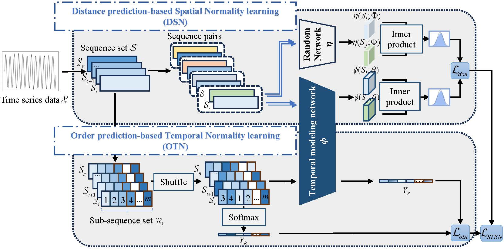

# STEN (ECML PKDD 2024)

Official PyTorch implementation of ["Self-Supervised Spatial-Temporal Normality Learning for Time Series Anomaly Detection"](https://arxiv.org/pdf/2406.19770).

## Overview
 Time Series Anomaly Detection (TSAD) finds widespread applications across various domains such as financial markets, industrial production, and healthcare. Its primary objective is to learn the normal patterns of time series data, thereby identifying deviations in test samples. Most existing TSAD methods focus on modeling data from the temporal dimension, while ignoring the semantic information in the spatial dimension. To address this issue, we introduce a novel approach, called Spatial-Temporal Normality learning (STEN). STEN is composed of a sequence Order prediction-based Temporal Normality learning (OTN) module that captures the temporal correlations within sequences, and a Distance prediction-based Spatial Normality learning (DSN) module that learns the relative spatial relations between sequences in a feature space. By synthesizing these two modules, STEN learns expressive spatial-temporal representations for the normal patterns hidden in the time series data. Extensive experiments on five popular TSAD benchmarks show that STEN substantially outperforms state-of-the-art competing methods.



## Setup
- python >= 3.8
- torch >= 1.11.0
- torchvision >= 0.14.0
- scipy >= 1.5.1
- scikit_learn >= 0.20.0
- numpy >= 1.19
- tqdm >= 4.62.3

we provide a `requirements.txt` in our repository.

## Device
Single NVIDIA GeForce RTX 3090


## Get Start
1. Download data. You can obtain all benchmarks from [Google Cloud](https://drive.google.com/drive/folders/1o1QtIsXUnIg4jwUHePUOeSwc_AGRoHIN?usp=drive_link). All the datasets are well pre-processed.

The dataset folder structure should look like:
```
data/
    dataset1/
        ...
    dataset2/
        ...
    ...
```
2. Train and evaluate. To run the model in the paper, run this command:
```bash
python main.py --model STEN --runs $runs --data $data
```
We also provide the experiment scripts of all benchmarks under the folder ```./scripts```. You can reproduce the experiment results as follows:
```bash
bash ./scripts/PSM.sh
bash ./scripts/MSL.sh
bash ./scripts/SMAP.sh
bash ./scripts/Epilepsy.sh
bash ./scripts/DSADS.sh
```

## Acknowledgement
We appreciate the following github repos a lot for their valuable code:

https://github.com/xuhongzuo/DeepOD

https://github.com/ahstat/affiliation-metrics-py

https://github.com/DAMO-DI-ML/KDD2023-DCdetector/tree/main


## Citation

```bibtex
@article{chen2024self,
  title={Self-Supervised Spatial-Temporal Normality Learning for Time Series Anomaly Detection},
  author={Chen, Yutong and Xu, Hongzuo and Pang, Guansong and Qiao, Hezhe and Zhou, Yuan and Shang, Mingsheng},
  journal={arXiv preprint arXiv:2406.19770},
  year={2024}
}
```
